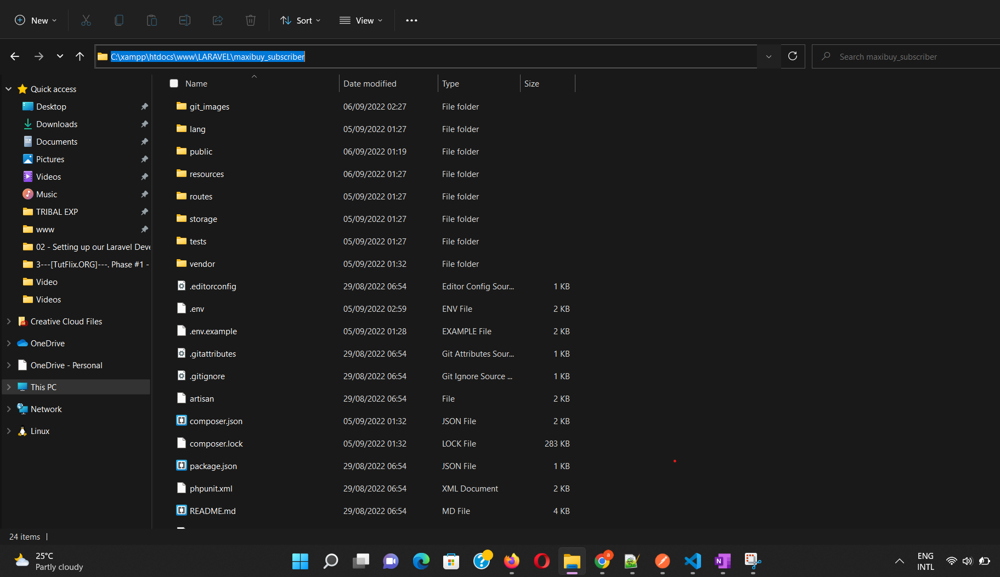
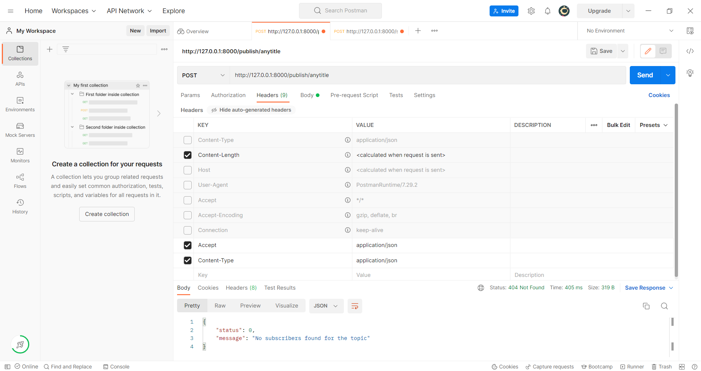

# Maxibuy Publish/Subscribe Server

## Description
To Publish a specific topic to subscriber of this topic

## Before you get Started on windows computer.
1. Make sure composer is installed, and its running on php 8
2. Make Sure Redis is installed on the computer, and the server has started
If you dont have REDIS below is a link to download it
https://github.com/microsoftarchive/redis/releases

## Things you need to setup quickly
1. Download the Laravel File as ZIP
https://github.com/agbolaayo/maxibuy_publisher

2. EXTRACT the zip file to a folder and OPEN the folder

3. On the directory of the folder as shown in the image below, type cmd, 
It will open command prompt to that path

4. Repeat Step 3, Three times, and before you continue make sure REDIS is installed in the computer

## Creating the server
1. We will create Publisher Server
type "php artisan serve --port=8000",,
This will generate a url like http://127.0.0.1:8000

2. We will create SUBSCRIBE server
type "php artisan serve --port=9000",,
This will generate a url like http://127.0.0.1:9000

3. Lastly we will need to setup the server that keep track of the subscribers
type "php artisan serve --port=9000",
It will not generate a url, but you wont be able to type anything, It will keep track of subscribe->topic when its being publish

## How to test in POSTMAN
- Please make sure the "Content Length" is selected, and the "Accept" and "Content type" is set to - "application/json" as in the picture below

